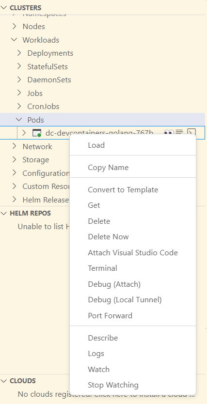

# Dev Container in Kubernetes

## Introduction

Install a dev container inside your cluster to develop and test in a real Kubernetes environment.

## Use cases

- Remote development with cluster network/storage context
- Standardized per-language dev workspace in Kubernetes

## How to use

- Base:

  ```sh
  kustomize build kustomize/devcontainers/kustomization/base
  ```

- Golang overlay:

  ```sh
  kustomize build kustomize/devcontainers/kustomization/overlays/golang
  ```

Attach with VSCode after deployment.

## Notes

Devcontainers is a remote development environment, you can use vscode to connect to a remote server, and use the server's resources to develop your code. When you run it in a kubernetes cluster, you can use the cluster's resources(compute, network, storage) and develop a true 'cloud-native' application.

VSCode (client) will interact with the dev container(pod) in the cluster, via kubectl and kube-proxy. So you don't need to open any port for the deployment.

Install required VSCode extensions:

- Dev Container
- Kubernetes

Then set kubeconfig, select the pod and `Attach Visual Studio Code`.



### For WSL user

:rotating_light: **Attach to Container** is not working in wsl, see [here](https://code.visualstudio.com/docs/devcontainers/containers#_docker-extension-limitations).

So, you have to install the tools (kubectl, vscode extensions) in your windows machine.

1. Install kubectl.exe and add into `PATH`
2. Set KUBECONFIG into env

  ```powershell
  $kubeconfig = "C:\Users\your\local\folder\config.yaml"

  [System.Environment]::SetEnvironmentVariable("KUBECONFIG", $kubeconfig, "User")

  ```

3. follow the steps [above](#usage)

### For storage(cache)

- [ ] workspace cache, for whole user path
- [ ] vscode cache, for extensions
